# CCTrader - Multi-Agent Cryptocurrency Trading Analysis System


AI-powered cryptocurrency trading analysis system using multiple specialized agents with Anthropic's Claude Agent SDK, CCXT for Bybit integration, and Perplexity for market intelligence.

## Features

- ✅ Real-time market data from Bybit via CCXT
- 📊 Multi-timeframe technical analysis (RSI, MACD, Bollinger Bands)
- 📰 Market sentiment analysis using Perplexity
- 🎯 Intelligent trading signal generation
- 💼 Portfolio monitoring and P&L tracking
- 💾 SQLite persistence for historical analysis
- 🔄 Continuous monitoring mode
- 🖥️ CLI interface
- 📈 Token tracking and cost estimation

## Installation

1. **Clone and setup:**
```bash
cd /home/deepol/work/cctrader
python -m venv venv
source venv/bin/activate
pip install -r requirements.txt
```

2. **Configure environment:**
```bash
cp .env.example .env
# Edit .env with your API keys
```

Required API keys in `.env`:
- `ANTHROPIC_API_KEY` - Your Anthropic API key
- `BYBIT_API_KEY` - Your Bybit API key
- `BYBIT_API_SECRET` - Your Bybit API secret

3. **Initialize database:**
```bash
python -m src.agent.main analyze --symbol BTC/USDT
```

## Usage

### Continuous Monitoring
Start continuous market monitoring with automatic analysis at regular intervals:
```bash
python -m src.agent.main monitor --symbol BTC/USDT --interval 300
```

### Single Analysis
Run a one-time market analysis:
```bash
python -m src.agent.main analyze --symbol BTC/USDT
```

Custom query:
```bash
python -m src.agent.main analyze --symbol ETH/USDT "What is the current market sentiment for Ethereum?"
```

### Market Movers Scanner

Run automated scanner to detect and analyze high-momentum movers (5%+ price changes):

```bash
python -m src.agent.main scan-movers --interval 300
```

#### Daily Session Mode

Maintain a single continuous conversation per trading day for consolidated analysis:

```bash
# All analyses in one session per day
python -m src.agent.main scan-movers --daily
```

**Benefits:**
- Consolidated view of all trading decisions
- Better context across analyses
- Easier review and debugging

See [Daily Session Mode Documentation](docs/daily-session-mode.md) for details.

### View Signals
Display recent trading signals from the database:
```bash
python -m src.agent.main signals --symbol BTC/USDT --limit 10
```

### Portfolio Status
Check current portfolio position:
```bash
python -m src.agent.main status --symbol BTC/USDT
```

### P&L Report

Display profit and loss metrics aggregated by trading symbol:

```bash
cctrader pnl-report --portfolio <name> [--period <daily|weekly|monthly|all>] [--min-trades <N>]
```

**Options:**
- `--portfolio`: Portfolio name (required)
- `--period`: Time period for analysis (default: all)
  - `daily`: Last 7 days
  - `weekly`: Last 4 weeks
  - `monthly`: Last 12 months
  - `all`: All-time performance
- `--min-trades`: Minimum trades to include symbol (default: 1)

**Example Output:**

```
┌─ Portfolio P&L Report ────────────────────────┐
│ Portfolio: default                             │
│ Period: Last 7 Days                            │
│ Total P&L: $1,234.56 (1.23%)                  │
│ Current Equity: $101,234.56                    │
└────────────────────────────────────────────────┘

┌─ P&L by Symbol ───────────────────────────────────────────────────────────┐
│ Symbol      │ Total P&L  │ Realized    │ Unrealized    │ Trades │ Win Rate │
├─────────────┼────────────┼─────────────┼───────────────┼────────┼──────────┤
│ BTC/USDT    │ $1,200.50  │ $1,150.00   │ $50.50        │ 15     │ 66.7%    │
│ ETH/USDT    │ $345.20    │ $300.00     │ $45.20        │ 10     │ 70.0%    │
│ SOL/USDT    │ -$150.30   │ -$200.00    │ $49.70        │ 8      │ 37.5%    │
└─────────────┴────────────┴─────────────┴───────────────┴────────┴──────────┘
```

## Token Tracking

Monitor Claude API token usage, estimate costs, and track rate limits.

### Features

- **Real-time tracking**: Captures tokens for every agent call
- **Cost estimation**: Calculates costs based on Sonnet 4.5 pricing
- **Rate limit monitoring**: Shows proximity to Claude Code hourly/daily limits
- **Historical analysis**: Query usage by hour, day, or session
- **Visual display**: Color-coded alerts (green/yellow/red) for limit warnings

### Usage

**View usage statistics:**
```bash
python -m agent.main token-stats --period hourly
python -m agent.main token-stats --period daily
```

**Check rate limit status:**
```bash
python -m agent.main token-limits
```

**Fetch current limits from docs:**
```bash
python -m agent.main fetch-limits
```

**Display tokens during analysis:**
```bash
python -m agent.main analyze --show-tokens
```

### Configuration

Configure in `.env`:

```env
# Enable/disable tracking
TOKEN_TRACKING_ENABLED=true

# Claude Code rate limits
CLAUDE_HOURLY_LIMIT=500
CLAUDE_DAILY_LIMIT=5000

# Pricing (per 1M tokens)
CLAUDE_COST_PER_1M_INPUT=3.00
CLAUDE_COST_PER_1M_OUTPUT=15.00

# Alert thresholds (%)
TOKEN_WARNING_THRESHOLD=50
TOKEN_CRITICAL_THRESHOLD=80

# Data retention (days)
TOKEN_HISTORY_DAYS=90
```

### Database Tables

Token tracking uses three tables:
- `token_usage`: Per-request metrics
- `token_sessions`: Session aggregates
- `rate_limit_tracking`: Rolling window counters

Initialize tables:
```bash
python scripts/init_token_tracking.py
```

## Architecture

### System Overview

```mermaid
flowchart TB
    subgraph CLI["CLI Layer"]
        MC[main.py]
        MC --> |monitor| MON[Continuous Monitor]
        MC --> |analyze| ANA[Single Analysis]
        MC --> |scan-movers| SCN[Market Scanner]
        MC --> |paper_status| PPR[Paper Trading]
    end

    subgraph SCANNER["Scanner Components"]
        SCN --> MMS[MarketMoversScanner]
        MMS --> MSC[MomentumScanner]
        MMS --> FSM[FuturesSymbolManager]
        MMS --> AGW[AgentWrapper]
        MMS --> RV[RiskValidator]
    end

    subgraph AGENT["Claude Agent Integration"]
        AGW --> |persistent_client| SDK[ClaudeSDKClient]
        SDK --> SM[SessionManager]
        SM --> |daily sessions| SID[(Session Storage)]
        SDK --> TOOLS[MCP Tools]
    end

    subgraph TOOLS_DETAIL["Agent Tools"]
        TOOLS --> MD[Market Data]
        TOOLS --> TA[Technical Analysis]
        TOOLS --> SA[Sentiment Analysis]
        TOOLS --> SIG[Signal Submission]
    end

    subgraph EXECUTION["Trade Execution"]
        SIG --> |confidence ≥60| PPM[PaperPortfolioManager]
        PPM --> EE[ExecutionEngine]
        PPM --> RM[RiskManager]
        EE --> |simulated fill| DB
    end

    subgraph EXTERNAL["External Services"]
        EX[Bybit Exchange]
        PPX[Perplexity MCP]
    end

    subgraph STORAGE["Database Layer"]
        DB[(SQLite)]
        DB --> |signals| SIG_T[movers_signals]
        DB --> |positions| POS_T[paper_positions]
        DB --> |metrics| MET_T[token_usage]
    end

    MD --> |CCXT| EX
    SA --> |WebSearch| PPX

    classDef cli fill:#e1f5fe
    classDef scanner fill:#fff3e0
    classDef agent fill:#f3e5f5
    classDef exec fill:#e8f5e9
    classDef external fill:#fce4ec
    classDef storage fill:#fff8e1

    class MC,MON,ANA,SCN,PPR cli
    class MMS,MSC,FSM,AGW,RV scanner
    class SDK,SM,SID,TOOLS agent
    class PPM,EE,RM exec
    class EX,PPX external
    class DB,SIG_T,POS_T,MET_T storage
```



### Scanner Data Flow


### Session Management (Daily Mode)


### Component Architecture


### Database Schema


### Tool Architecture

```mermaid
flowchart LR
    subgraph BUNDLED["Scanner Bundled Tools"]
        FTS[fetch_technical_snapshot]
        FSD[fetch_sentiment_data]
        STS[submit_trading_signal]
    end

    subgraph TECHNICAL["Technical Analysis"]
        AT[analyze_trend]
        AM[analyze_momentum]
        AV[analyze_volatility]
        AP[analyze_patterns]
    end

    subgraph MARKET["Market Data"]
        FMD[fetch_market_data]
        GCP[get_current_price]
    end

    subgraph EXTERNAL["External APIs"]
        BYBIT[(Bybit/CCXT)]
        WEB[(WebSearch/Perplexity)]
    end

    FTS --> FMD
    FTS --> AT
    FTS --> AM
    FTS --> AV
    FTS --> AP

    FSD --> WEB

    FMD --> BYBIT
    GCP --> BYBIT

    STS --> |confidence ≥60| SIGNAL[Trading Signal]
    STS --> |confidence <60| REJECT[Rejected]
```



## Agent Workflow

1. **Data Collection**: Fetches OHLCV data from Bybit across multiple timeframes
2. **Technical Analysis**: Calculates RSI, MACD, Bollinger Bands for each timeframe
3. **Sentiment Analysis**: Queries Perplexity for market news, events, and sentiment
4. **Signal Generation**: Combines technical + sentiment analysis to generate signals
5. **Database Storage**: Persists all analysis and signals for historical tracking
6. **Portfolio Monitoring**: Calculates P&L for open positions with alerts

## Configuration

Edit `.env` file to customize:

```env
# API Keys
ANTHROPIC_API_KEY=your_key_here
BYBIT_API_KEY=your_key_here
BYBIT_API_SECRET=your_secret_here

# Exchange Settings
BYBIT_TESTNET=false
DEFAULT_SYMBOL=BTC/USDT

# Agent Settings
MAX_TURNS=20
MAX_BUDGET_USD=1.0
ANALYSIS_INTERVAL=300

# Database
DB_PATH=./trading_data.db
```

## Technical Details

**Technologies:**
- **Claude Agent SDK** - AI agent framework
- **CCXT 4.2+** - Exchange connectivity
- **pandas-ta** - Technical indicators
- **Perplexity MCP** - Market intelligence
- **SQLite** - Data persistence
- **Rich CLI** - Terminal interface

**Supported Timeframes:**
- 1m, 5m, 15m (short-term)
- 1h, 4h (medium-term)
- 1d (long-term)

**Technical Indicators:**
- RSI (14-period)
- MACD (12, 26, 9)
- Bollinger Bands (20, 2)
- Volume SMA (20-period)

## API Keys Required

1. **Anthropic API Key**: Get from https://console.anthropic.com/
2. **Bybit API Credentials**: Create at https://www.bybit.com/app/user/api-management
3. **Perplexity MCP**: Already configured in Claude Code environment

## Safety Features

- Read-only market data by default (no automatic trading)
- Stop-loss and take-profit alerts
- Historical signal tracking
- Configurable budget limits
- Testnet support for development

## License

MIT

## Support

For issues or questions, please check the implementation plan or review the code documentation.
