# Market Movers Trading Strategy - Comprehensive Design

**Date:** 2025-11-18
**Version:** 1.0
**Status:** Design Approved

## Table of Contents
1. [Overview](#overview)
2. [System Architecture](#system-architecture)
3. [Core Components](#core-components)
4. [Confidence Scoring System](#confidence-scoring-system)
5. [Agent Decision-Making Process](#agent-decision-making-process)
6. [Position Management](#position-management)
7. [Portfolio Risk Management](#portfolio-risk-management)
8. [Scanning Algorithm](#scanning-algorithm)
9. [Data Flow Diagrams](#data-flow-diagrams)
10. [Configuration Parameters](#configuration-parameters)

---

## Overview

The **Market Movers Trading Strategy** is an AI-powered momentum trading system that identifies and trades high-volatility cryptocurrency futures on Bybit. It combines real-time market scanning with Claude Agent SDK's intelligent decision-making to capture short-term momentum plays.

### Strategy Characteristics
- **Approach:** Short-term momentum trading (1-8 hour holds)
- **Direction:** LONG on gainers (+5%+), SHORT on losers (-5%+)
- **Execution:** Automated paper trading with full risk management
- **Analysis:** Multi-factor confidence-based position sizing
- **Risk:** Moderate (max 25% portfolio exposure, 8% daily loss limit)

### Key Features
✅ Real-time scanning of all Bybit USDT perpetual futures
✅ AI agent-based comprehensive analysis using Claude SDK
✅ Multi-timeframe technical analysis (1m, 5m, 15m, 1h, 4h)
✅ Market sentiment analysis via Perplexity
✅ Confidence-based position sizing (60-100 scale)
✅ Dynamic trailing stops with partial profit-taking
✅ Portfolio-level risk controls
✅ Automated paper trading execution

---

## System Architecture

```mermaid
graph TB
    subgraph "Market Movers Scanner"
        A[Futures Symbol Manager] --> B[Momentum Scanner]
        B --> C[Pre-Filter Queue]
    end

    subgraph "Claude Agent Analysis Layer"
        C --> D[Agent Invocation]
        D --> E[Multi-Timeframe Data Collection]
        E --> F[Technical Analysis Tools]
        E --> G[Sentiment Analysis Tools]
        E --> H[Liquidity Check Tools]
        F --> I[Agent Reasoning Engine]
        G --> I
        H --> I
        I --> J[Confidence Score Calculator]
        J --> K{Confidence ≥ 60?}
    end

    subgraph "Risk Management Layer"
        K -->|Yes| L[Portfolio Risk Checks]
        L --> M{All Limits OK?}
        M -->|Yes| N[Auto-Execute Paper Trade]
        M -->|No| O[Log Rejection]
        K -->|No| O
    end

    subgraph "Position Management"
        N --> P[Position Monitoring Loop]
        P --> Q[Dynamic Stop Management]
        P --> R[Profit Target Execution]
        Q --> S[Exit & Update Portfolio]
        R --> S
    end

    subgraph "Data Persistence"
        N --> T[(Trading DB)]
        S --> T
        O --> T
        I --> T
    end

    style D fill:#f9f,stroke:#333,stroke-width:4px
    style I fill:#f9f,stroke:#333,stroke-width:4px
    style J fill:#f9f,stroke:#333,stroke-width:4px
```



---

## Core Components

### 1. Futures Symbol Manager

**Responsibility:** Maintain list of tradeable Bybit USDT perpetual futures

**Operations:**
- Fetch all USDT perpetual futures on startup via CCXT
- Filter for minimum liquidity (>$1M daily volume)
- Store symbol metadata:
  - Tick size (price precision)
  - Minimum order size
  - Maximum leverage
  - Contract multiplier
- Refresh list every 60 minutes (background task)
- Handle new listings automatically

**Implementation:**
```python
class FuturesSymbolManager:
    def __init__(self, exchange):
        self.exchange = exchange
        self.symbols = {}
        self.last_refresh = None

    def refresh_symbols(self):
        """Fetch and filter tradeable futures"""
        markets = self.exchange.load_markets()
        usdt_futures = [
            symbol for symbol, market in markets.items()
            if market['type'] == 'swap'
            and market['quote'] == 'USDT'
            and market['info'].get('quoteCoin') == 'USDT'
        ]

        # Filter by volume
        tickers = self.exchange.fetch_tickers(usdt_futures)
        self.symbols = {
            symbol: market
            for symbol, market in markets.items()
            if symbol in usdt_futures
            and tickers[symbol]['quoteVolume'] > 1_000_000
        }

        self.last_refresh = datetime.now()
        return self.symbols
```

### 2. Momentum Scanner

**Responsibility:** Identify movers exceeding ±5% threshold

**Scanning Parameters:**
- **Timeframes:** 1h and 4h percentage changes
- **Threshold:** ±5% for gainers/losers
- **Frequency:** Every 5 minutes
- **Output:** Sorted list of movers (by % change magnitude)

**Algorithm:**
```python
def scan_for_movers(symbols, threshold=5.0):
    """Scan all symbols for momentum exceeding threshold"""
    movers = {'gainers': [], 'losers': []}

    for symbol in symbols:
        # Fetch 1h and 4h data
        ohlcv_1h = exchange.fetch_ohlcv(symbol, '1h', limit=2)
        ohlcv_4h = exchange.fetch_ohlcv(symbol, '4h', limit=2)

        # Calculate % changes
        change_1h = ((ohlcv_1h[-1][4] - ohlcv_1h[-2][4]) / ohlcv_1h[-2][4]) * 100
        change_4h = ((ohlcv_4h[-1][4] - ohlcv_4h[-2][4]) / ohlcv_4h[-2][4]) * 100

        max_change = max(abs(change_1h), abs(change_4h))

        if max_change >= threshold:
            mover = {
                'symbol': symbol,
                'change_1h': change_1h,
                'change_4h': change_4h,
                'max_change': max_change,
                'direction': 'LONG' if change_1h > 0 else 'SHORT'
            }

            if change_1h > 0:
                movers['gainers'].append(mover)
            else:
                movers['losers'].append(mover)

    # Sort by magnitude
    movers['gainers'].sort(key=lambda x: x['max_change'], reverse=True)
    movers['losers'].sort(key=lambda x: x['max_change'], reverse=True)

    return movers
```

### 3. Multi-Factor Analyzer (Claude Agent)

**Responsibility:** Deep analysis of each mover using AI reasoning

The agent uses available tools to:
1. Gather multi-timeframe OHLCV data
2. Calculate technical indicators
3. Analyze market sentiment
4. Check liquidity and volume
5. Assess BTC correlation
6. Calculate confidence score
7. Make final trade decision

**Agent Prompt Template:**
```
Analyze {symbol} as a potential {direction} opportunity.

Context:
- Current momentum: {change_1h}% in 1h, {change_4h}% in 4h
- Current price: {current_price}
- Paper portfolio: ${portfolio_value}, {open_positions}/5 positions open, {exposure}% exposure

Your task:
1. Gather multi-timeframe technical analysis (1m, 5m, 15m, 1h, 4h)
2. Analyze market sentiment and detect any catalysts using Perplexity
3. Check liquidity and volume quality
4. Assess correlation with BTC and overall market
5. Calculate confidence score (0-100) based on:
   - Technical alignment (40 points)
   - Sentiment score (30 points)
   - Liquidity quality (20 points)
   - Market correlation (10 points)
6. Determine if this is a HIGH PROBABILITY trade (confidence ≥ 60)
7. If yes, specify exact entry, stop-loss, take-profit, and position size

Use your tools systematically. Think step-by-step. Show your reasoning.

IMPORTANT: Only recommend trades with confidence ≥ 60. Be conservative.
```

### 4. Signal Router

**Responsibility:** Filter and route signals through risk checks

**Flow:**

```mermaid
graph LR
    A[Agent Signal] --> B{Confidence ≥ 60?}
    B -->|No| C[Log Low Confidence]
    B -->|Yes| D{Portfolio Limits?}
    D -->|Fail| E[Log Rejection]
    D -->|Pass| F{Daily Loss OK?}
    F -->|Fail| E
    F -->|Pass| G{Correlation OK?}
    G -->|Fail| E
    G -->|Pass| H[Auto-Execute]

    style H fill:#9f9,stroke:#333,stroke-width:2px
```


---

## Confidence Scoring System

### Scoring Framework (0-100 Scale)

The confidence score determines whether to trade and position sizing:

| Confidence | Action | Risk Per Trade |
|------------|--------|----------------|
| 80-100 | Execute - High | 2-3% |
| 60-79 | Execute - Medium | 1-2% |
| 40-59 | No Trade | 0% |
| 0-39 | No Trade | 0% |

### Calculation Breakdown

#### 1. Technical Alignment Strength (40 points max)

**For each timeframe (1m, 5m, 15m, 1h, 4h), score:**

| Indicator | Condition | Points |
|-----------|-----------|--------|
| **RSI** | 30-70 range (healthy) | +2 |
| | Oversold bounce (<30 for long) | +1 |
| | Overbought (>70 for long) | -1 |
| **MACD** | Bullish cross (histogram positive) | +2 |
| | Bearish cross | -2 |
| | Histogram aligned with trend | +1 |
| **Bollinger Bands** | Price near upper band (long) | +1 |
| | Price near lower band (short) | +1 |
| **Volume** | Above 20-period SMA | +2 |
| | Below average | 0 |

**Calculation:**
1. Sum points for each timeframe
2. Average across all 5 timeframes
3. Normalize to 0-40 scale
4. Weight: Recent timeframes higher (4h: 30%, 1h: 25%, 15m: 20%, 5m: 15%, 1m: 10%)

**Example:**
```
4h:  RSI=55(+2) + MACD_cross(+2) + BB(+1) + Vol(+2) = 7 points → 7 * 0.30 = 2.1
1h:  RSI=62(+2) + MACD_hist(+1) + BB(+1) + Vol(+2) = 6 points → 6 * 0.25 = 1.5
15m: RSI=58(+2) + MACD_hist(+1) + BB(+1) + Vol(+2) = 6 points → 6 * 0.20 = 1.2
5m:  RSI=65(+2) + MACD_hist(+1) + BB(+1) + Vol(+0) = 4 points → 4 * 0.15 = 0.6
1m:  RSI=70(+2) + MACD_hist(+1) + BB(+0) + Vol(+2) = 5 points → 5 * 0.10 = 0.5

Weighted Sum = 2.1 + 1.5 + 1.2 + 0.6 + 0.5 = 5.9
Normalize to 40-point scale: (5.9 / 7) * 40 = 33.7 ≈ 34 points
```

#### 2. Sentiment Score (30 points max)

**Based on Perplexity analysis:**

| Sentiment | Examples | Points (Long) | Points (Short) |
|-----------|----------|---------------|----------------|
| **Strong Positive** | Major partnership, protocol upgrade, institutional adoption | 25-30 | 0-5 |
| **Mild Positive** | Positive social buzz, minor announcements | 15-24 | 6-14 |
| **Neutral** | No significant news | 10-14 | 10-14 |
| **Mild Negative** | Minor FUD, profit-taking mentioned | 5-9 | 15-24 |
| **Strong Negative** | Hack, regulation, major exploit | 0-4 | 25-30 |

**Agent Instructions:**
- Query Perplexity: "Recent news and sentiment for {symbol} in last 24 hours"
- Analyze response for catalysts, events, social sentiment
- Classify sentiment category
- Assign points based on direction (invert for shorts)

**Example Prompt to Perplexity:**
```
What is the current market sentiment for Solana (SOL) cryptocurrency?

Include:
1. Any significant news or events in the last 24 hours
2. Social media sentiment (bullish/bearish/neutral)
3. Key catalysts or developments
4. Any concerns or negative factors

Provide a concise summary.
```

#### 3. Liquidity & Volume Quality (20 points max)

| Metric | Condition | Points |
|--------|-----------|--------|
| **24h Volume vs 7-day Avg** | >2x average | 20 |
| | 1.5x - 2x | 15 |
| | 1x - 1.5x | 10 |
| | <1x average | 5 |
| **Bid/Ask Spread** | <0.05% | +5 bonus |
| **Order Book Depth** | Deep (>$500k at ±0.5%) | +3 bonus |

**Max Total:** 20 points (base) + bonuses capped at 28 total

#### 4. Market Correlation Analysis (10 points max)

| Correlation | Condition | Points |
|-------------|-----------|--------|
| **BTC Alignment** | Moving with BTC uptrend | 10 |
| | Moving against BTC (relative strength) | 7 |
| | BTC in downtrend | 3 |
| **Relative Strength** | Outperforming BTC by >3% | +3 bonus |

**Calculation:**
```python
def calculate_correlation_score(symbol_returns, btc_returns):
    """Calculate correlation score with BTC"""

    # Get BTC 1h return
    btc_change = btc_returns[-1]
    symbol_change = symbol_returns[-1]

    # Calculate relative strength
    relative_strength = symbol_change - btc_change

    # Base score
    if btc_change > 0:  # BTC uptrend
        score = 10 if symbol_change > 0 else 5
    else:  # BTC downtrend
        score = 7 if symbol_change > 0 else 3

    # Bonus for outperformance
    if relative_strength > 3.0:
        score = min(score + 3, 10)

    return score
```

### Final Confidence Score

```python
def calculate_confidence_score(technical, sentiment, liquidity, correlation):
    """Combine all factors into final confidence score"""

    confidence = (
        technical +      # 0-40 points
        sentiment +      # 0-30 points
        liquidity +      # 0-20 points (capped at 28 with bonuses)
        correlation      # 0-10 points (capped at 13 with bonuses)
    )

    # Cap at 100
    confidence = min(confidence, 100)

    return confidence
```

**Example Calculation:**
```
Technical:    34 / 40 points
Sentiment:    23 / 30 points
Liquidity:    18 / 20 points
Correlation:   5 / 10 points
─────────────────────────────
Total:        80 / 100 points → HIGH CONFIDENCE → 2-3% risk
```

---

## Agent Decision-Making Process

### Agent Tool Call Sequence


### Agent Reasoning Examples

#### High Confidence Trade (Execute)

```
Agent Analysis for SOLUSDT:

STEP 1: Multi-timeframe data collection
✓ Fetched 1m, 5m, 15m, 1h, 4h OHLCV data

STEP 2: Technical analysis
- 4h: RSI=55 (healthy), MACD bullish cross, above BB middle, volume 2.1x → 7/7
- 1h: RSI=62 (healthy), MACD histogram growing, near BB upper, volume 2.3x → 6/7
- 15m: RSI=58 (healthy), MACD aligned, BB middle, volume 1.8x → 6/7
- 5m: RSI=65 (healthy), MACD aligned, BB middle, volume 1.2x → 4/7
- 1m: RSI=70 (approaching OB), MACD aligned, BB middle, volume 2.0x → 5/7

Weighted technical score: 34/40 ✓ STRONG

STEP 3: Sentiment analysis (Perplexity)
Query: "Recent news and sentiment for Solana cryptocurrency"
Result: Partnership with major DeFi protocol announced 4 hours ago. Twitter sentiment
showing 78% positive mentions. No negative catalysts detected.

Sentiment classification: STRONG POSITIVE
Sentiment score: 25/30 ✓ STRONG

STEP 4: Liquidity check
- 24h volume: $1.2B (2.3x 7-day average) → 20 points
- Bid/ask spread: 0.03% → +5 bonus
- Order book depth: $680k at ±0.5% → +3 bonus
Liquidity score: 28/20 (capped at 20) ✓ EXCELLENT

STEP 5: BTC correlation
- BTC 1h change: +2.1%
- SOL 1h change: +7.2%
- Relative strength: +5.1%
- Moving with BTC uptrend, showing strong outperformance
Correlation score: 10/10 ✓ STRONG

CONFIDENCE CALCULATION:
Technical:    34/40
Sentiment:    25/30
Liquidity:    20/20
Correlation:  10/10
──────────────────
TOTAL:        89/100 ✓ HIGH CONFIDENCE

POSITION SIZING:
Confidence tier: HIGH (80-100) → 2.5% risk
Entry: $145.30
Stop-loss: $138.20 (-4.88%)
Position size: $250 risk / $7.10 stop = 1.72 SOL

Take-profit plan:
- TP1: $151.80 (+4.47%, 2:1 R/R) - Exit 50%
- TP2: Trailing stop at 2.5% below peak

DECISION: ✅ EXECUTE LONG
Reasoning: Strong technical alignment across all timeframes, confirmed positive catalyst,
excellent liquidity, and outperforming BTC. High probability momentum setup.
```

#### Low Confidence Trade (Reject)

```
Agent Analysis for DOGEUSDT:

STEP 1: Multi-timeframe data collection
✓ Fetched 1m, 5m, 15m, 1h, 4h OHLCV data

STEP 2: Technical analysis
- 4h: RSI=72 (overbought), MACD weakening, near BB upper, volume 0.8x → 3/7
- 1h: RSI=78 (overbought), MACD bearish divergence, above BB upper, volume 1.1x → 1/7
- 15m: RSI=81 (extreme OB), MACD rolling over, above BB, volume 0.9x → 0/7
- 5m: RSI=75 (overbought), MACD negative, BB upper, volume 0.7x → 1/7
- 1m: RSI=68 (elevated), MACD negative, BB middle, volume 1.0x → 3/7

Weighted technical score: 12/40 ⚠️ WEAK (bearish divergence, overbought)

STEP 3: Sentiment analysis (Perplexity)
Query: "Recent news and sentiment for Dogecoin cryptocurrency"
Result: Elon Musk tweet 6 hours ago caused initial pump. No fundamental developments.
Social sentiment mixed, many calling it "pump and dump". Profit-taking mentioned.

Sentiment classification: NEUTRAL TO NEGATIVE
Sentiment score: 8/30 ⚠️ WEAK (no real catalyst, tweet-driven)

STEP 4: Liquidity check
- 24h volume: $840M (1.2x 7-day average) → 10 points
- Bid/ask spread: 0.08% → no bonus
- Order book depth: $180k at ±0.5% → no bonus
Liquidity score: 10/20 ⚠️ MODERATE

STEP 5: BTC correlation
- BTC 1h change: +1.5%
- DOGE 1h change: +6.8%
- Relative strength: +5.3%
- Moving with BTC but showing signs of exhaustion
Correlation score: 7/10 ✓ MODERATE

CONFIDENCE CALCULATION:
Technical:    12/40 ⚠️
Sentiment:     8/30 ⚠️
Liquidity:    10/20
Correlation:   7/10
──────────────────
TOTAL:        37/100 ❌ LOW CONFIDENCE

DECISION: ❌ REJECT - DO NOT TRADE
Reasoning: Despite strong price movement, technical indicators show extreme overbought
conditions with bearish divergence on 1h timeframe. No fundamental catalyst - just
Twitter-driven FOMO. High risk of reversal. Confidence below 60 threshold.

Recommendation: Wait for pullback and consolidation before considering entry.
```

---

## Position Management

### Position Lifecycle


### Exit Management Details

#### Phase 1: Risk Protection (0% to +1% profit)

**Objective:** Protect capital with initial stop-loss

**Stop-loss placement:**
- LONG: Below recent swing low (last 20 candles on 15m)
- SHORT: Above recent swing high (last 20 candles on 15m)
- Minimum stop distance: 2%
- Maximum stop distance: 5%

**No adjustments in this phase**

**Example:**
```
Entry: $145.30 LONG
Swing low (15m): $138.20
Stop-loss: $138.20 (-4.88%)
Current price: $146.75 (+1.00%)
Action: Hold, maintain stop at $138.20
```

#### Phase 2: Breakeven Protection (+1% to +2% profit)

**Objective:** Eliminate risk by moving stop to entry

**Trigger:** Position reaches +1% profit
**Action:** Move stop-loss to entry price (breakeven)
**Benefit:** Guarantees no loss on the trade

**Example:**
```
Entry: $145.30 LONG
Original stop: $138.20 (-4.88%)
Current price: $146.76 (+1.00%)
Action: Move stop to $145.30 (breakeven)
Status: Risk-free trade
```

#### Phase 3: Trailing Profit (+2% profit and above)

**Objective:** Maximize profits while protecting gains

**Trigger:** Position reaches +2% profit
**Action:** Activate ATR-based trailing stop

**Trailing stop distance:**
- High confidence (80-100): Trail 2.5% below peak price
- Medium confidence (60-79): Trail 2.0% below peak price

**Stop adjustment rules:**
- Recalculate every 5 minutes
- Only move stop UP (or tighter), never down
- Track peak price since trailing activation

**Example:**
```
Entry: $145.30 LONG (confidence: 85)
Current price: $148.21 (+2.00%)
Action: Activate trailing stop

Peak tracking:
- Minute 0: Peak $148.21, Stop $144.55 (2.5% below)
- Minute 5: Peak $149.80, Stop $146.05 (2.5% below) ✓ Moved up
- Minute 10: Peak $149.80, Stop $146.05 (no change, peak unchanged)
- Minute 15: Peak $151.20, Stop $147.42 (2.5% below) ✓ Moved up
- Minute 20: Price drops to $147.42 → EXIT at trailing stop
Final: +1.46% profit on remaining 50%
```

### Partial Profit-Taking Strategy

**TP1: 2:1 Risk/Reward Ratio**

**Trigger:** Price reaches 2x the risk amount
**Action:** Exit 50% of position
**Stop adjustment:** Move remaining 50% stop to breakeven

**Calculation:**
```python
def calculate_tp1(entry, stop_loss, direction):
    """Calculate TP1 at 2R"""
    risk_distance = abs(entry - stop_loss)
    reward_distance = risk_distance * 2

    if direction == 'LONG':
        tp1 = entry + reward_distance
    else:  # SHORT
        tp1 = entry - reward_distance

    return tp1

# Example
entry = 145.30
stop = 138.20
risk = 7.10
reward = 7.10 * 2 = 14.20
tp1 = 145.30 + 14.20 = 159.50

# If risking $200:
# At TP1, profit = $400 (2:1)
# Exit 50% = $200 profit locked
# Remaining 50% has $200 risk eliminated (stop at breakeven)
```

**TP2: Trailing Stop**

**Management:** Remaining 50% uses trailing stop (Phase 3)
**Objective:** Capture extended moves
**Protection:** Stop at breakeven guarantees TP1 profit is locked

### Continuous Monitoring Logic

**Monitoring frequency:** Every 5 minutes (while position open)

**Monitoring checklist:**
```python
def monitor_position(position):
    """Monitor open position and manage exits"""

    # 1. Fetch current price
    current_price = exchange.fetch_ticker(position.symbol)['last']

    # 2. Calculate current P&L
    if position.direction == 'LONG':
        pnl_pct = ((current_price - position.entry_price) / position.entry_price) * 100
    else:
        pnl_pct = ((position.entry_price - current_price) / position.entry_price) * 100

    # 3. Check stop-loss
    if position.direction == 'LONG':
        if current_price <= position.stop_loss:
            return execute_exit(position, current_price, reason='STOP_LOSS_HIT')
    else:
        if current_price >= position.stop_loss:
            return execute_exit(position, current_price, reason='STOP_LOSS_HIT')

    # 4. Check TP1
    if not position.tp1_hit:
        if position.direction == 'LONG':
            if current_price >= position.tp1_price:
                return execute_partial_exit(position, current_price, 0.5, reason='TP1_HIT')
        else:
            if current_price <= position.tp1_price:
                return execute_partial_exit(position, current_price, 0.5, reason='TP1_HIT')

    # 5. Update trailing stop (if in Phase 3)
    if pnl_pct >= 2.0:
        update_trailing_stop(position, current_price)

    # 6. Re-analyze confidence (every 15 min)
    if minutes_since_last_analysis >= 15:
        new_confidence = agent.re_analyze_position(position)
        if new_confidence < 40:
            return alert_user(position, reason='CONFIDENCE_DROPPED', confidence=new_confidence)

    # 7. Update database
    position.update_pnl(pnl_pct, current_price)
    position.save()
```

### Time-Based Monitoring

**Re-analysis trigger:** Every 15 minutes

**Agent re-analysis prompt:**
```
Re-analyze open position for {symbol} {direction}.

Position details:
- Entry: {entry_price} @ {entry_time}
- Current price: {current_price}
- P&L: {pnl_pct}%
- Original confidence: {original_confidence}
- Time in position: {duration} minutes

Check:
1. Has market sentiment changed? (query Perplexity)
2. Are technicals still aligned?
3. Any new events or catalysts?
4. Is momentum weakening?

Calculate updated confidence score. If <40, recommend early exit.
```

**Early exit consideration:**
- Confidence drops below 40
- Major news contradicts thesis
- Technical reversal patterns detected
- Alert user for manual decision

---

## Portfolio Risk Management

### Pre-Trade Risk Gates

Every signal must pass ALL risk checks before execution:

```mermaid
graph TD
    A[Agent Signal Ready] --> B{Confidence ≥ 60?}
    B -->|No| Z[REJECT]
    B -->|Yes| C{Positions < 5?}
    C -->|No| Z
    C -->|Yes| D{Total Exposure + New ≤ 25%?}
    D -->|No| Z
    D -->|Yes| E{Daily P&L > -8%?}
    E -->|No| Z
    E -->|Yes| F{New Risk + Existing ≤ Daily Limit?}
    F -->|No| Z
    F -->|Yes| G{Weekly P&L > -15%?}
    G -->|No| Z
    G -->|Yes| H{Correlation Check OK?}
    H -->|No| Z
    H -->|Yes| I[✅ EXECUTE]

    style I fill:#9f9,stroke:#333,stroke-width:3px
    style Z fill:#f99,stroke:#333,stroke-width:3px
```



### Risk Check Details

#### 1. Confidence Threshold
```python
MIN_CONFIDENCE = 60

if signal.confidence < MIN_CONFIDENCE:
    reject(reason=f"Confidence {signal.confidence} below threshold {MIN_CONFIDENCE}")
```

#### 2. Position Limit
```python
MAX_CONCURRENT_POSITIONS = 5

if portfolio.count_open_positions() >= MAX_CONCURRENT_POSITIONS:
    reject(reason=f"At maximum {MAX_CONCURRENT_POSITIONS} positions")
```

#### 3. Exposure Limit
```python
MAX_TOTAL_EXPOSURE_PCT = 25.0  # % of portfolio

current_exposure = portfolio.calculate_total_exposure()
new_exposure = signal.position_size_usd / portfolio.total_value * 100
total_exposure = current_exposure + new_exposure

if total_exposure > MAX_TOTAL_EXPOSURE_PCT:
    reject(reason=f"Exposure would be {total_exposure:.1f}% (max {MAX_TOTAL_EXPOSURE_PCT}%)")
```

#### 4. Daily Loss Circuit Breaker
```python
DAILY_LOSS_LIMIT_PCT = -8.0

current_daily_pnl = portfolio.calculate_daily_pnl_pct()

if current_daily_pnl <= DAILY_LOSS_LIMIT_PCT:
    # STOP ALL TRADING
    close_all_positions()
    pause_trading_until_tomorrow()
    alert_user(reason='DAILY_LOSS_LIMIT_HIT', pnl=current_daily_pnl)
    reject(reason=f"Daily loss limit hit: {current_daily_pnl:.2f}%")

# Also check worst-case scenario
max_new_risk_pct = signal.risk_amount_usd / portfolio.total_value * 100
worst_case_daily = current_daily_pnl - max_new_risk_pct

if worst_case_daily <= DAILY_LOSS_LIMIT_PCT:
    reject(reason=f"Worst case would exceed daily limit: {worst_case_daily:.2f}%")
```

#### 5. Weekly Loss Limit
```python
WEEKLY_LOSS_LIMIT_PCT = -15.0

weekly_pnl = portfolio.calculate_weekly_pnl_pct()  # Rolling 7 days

if weekly_pnl <= WEEKLY_LOSS_LIMIT_PCT:
    pause_trading_for_week()
    alert_user(reason='WEEKLY_LOSS_LIMIT_HIT', pnl=weekly_pnl)
    reject(reason=f"Weekly loss limit hit: {weekly_pnl:.2f}%")
```

#### 6. Correlation Check
```python
MAX_CORRELATED_POSITIONS = 2

CORRELATION_GROUPS = {
    'BTC_CORRELATED': ['BTC', 'ETH', 'BNB', 'SOL', 'ADA', 'AVAX', 'DOT', 'MATIC'],
    'DEFI': ['UNI', 'AAVE', 'COMP', 'MKR', 'SNX', 'CRV', 'SUSHI'],
    'GAMING': ['AXS', 'SAND', 'MANA', 'ENJ', 'GALA', 'ILV'],
    'AI': ['FET', 'AGIX', 'OCEAN', 'GRT'],
    'MEME': ['DOGE', 'SHIB', 'PEPE', 'FLOKI'],
    'LAYER2': ['ARB', 'OP', 'MATIC', 'IMX'],
}

def check_correlation_limit(portfolio, new_signal):
    """Ensure not too many correlated positions"""

    # Identify group for new signal
    new_group = None
    for group, symbols in CORRELATION_GROUPS.items():
        if any(sym in new_signal.symbol for sym in symbols):
            new_group = group
            break

    if new_group is None:
        return True  # Uncategorized, allow

    # Count existing positions in same group
    count_in_group = 0
    for position in portfolio.open_positions:
        for group, symbols in CORRELATION_GROUPS.items():
            if group == new_group and any(sym in position.symbol for sym in symbols):
                count_in_group += 1
                break

    if count_in_group >= MAX_CORRELATED_POSITIONS:
        reject(reason=f"Already have {count_in_group} positions in {new_group} group (max {MAX_CORRELATED_POSITIONS})")
        return False

    return True
```

### Risk Metrics Tracking

**Calculated and logged every scan cycle:**

```python
class PortfolioRiskMetrics:
    def __init__(self, portfolio):
        self.portfolio = portfolio

    def calculate_metrics(self):
        return {
            # Position metrics
            'open_positions': self.portfolio.count_open_positions(),
            'max_positions': MAX_CONCURRENT_POSITIONS,

            # Exposure metrics
            'total_exposure_pct': self.calculate_total_exposure(),
            'max_exposure_pct': MAX_TOTAL_EXPOSURE_PCT,
            'exposure_used_pct': (self.calculate_total_exposure() / MAX_TOTAL_EXPOSURE_PCT) * 100,

            # P&L metrics
            'daily_pnl_pct': self.portfolio.calculate_daily_pnl_pct(),
            'daily_pnl_usd': self.portfolio.calculate_daily_pnl_usd(),
            'daily_limit_remaining': DAILY_LOSS_LIMIT_PCT - self.portfolio.calculate_daily_pnl_pct(),

            'weekly_pnl_pct': self.portfolio.calculate_weekly_pnl_pct(),
            'weekly_pnl_usd': self.portfolio.calculate_weekly_pnl_usd(),
            'weekly_limit_remaining': WEEKLY_LOSS_LIMIT_PCT - self.portfolio.calculate_weekly_pnl_pct(),

            # Risk metrics
            'total_risk_usd': self.calculate_total_risk(),
            'total_risk_pct': (self.calculate_total_risk() / self.portfolio.total_value) * 100,
            'avg_risk_per_position': self.calculate_avg_risk_per_position(),

            # Correlation metrics
            'correlation_groups': self.analyze_correlation_distribution(),

            # Status
            'trading_allowed': self.is_trading_allowed(),
            'risk_level': self.assess_risk_level(),  # LOW, MODERATE, HIGH, CRITICAL
        }

    def calculate_total_exposure(self):
        """Sum of all position sizes as % of portfolio"""
        total = sum(p.size_usd for p in self.portfolio.open_positions)
        return (total / self.portfolio.total_value) * 100

    def calculate_total_risk(self):
        """Sum of all stop-loss risk amounts"""
        return sum(p.risk_amount_usd for p in self.portfolio.open_positions)

    def is_trading_allowed(self):
        """Check if trading is currently allowed"""
        if self.portfolio.calculate_daily_pnl_pct() <= DAILY_LOSS_LIMIT_PCT:
            return False
        if self.portfolio.calculate_weekly_pnl_pct() <= WEEKLY_LOSS_LIMIT_PCT:
            return False
        return True

    def assess_risk_level(self):
        """Categorize current risk level"""
        daily_pnl = self.portfolio.calculate_daily_pnl_pct()
        exposure = self.calculate_total_exposure()

        if daily_pnl <= -6 or exposure >= 22:
            return 'CRITICAL'
        elif daily_pnl <= -4 or exposure >= 18:
            return 'HIGH'
        elif daily_pnl <= -2 or exposure >= 12:
            return 'MODERATE'
        else:
            return 'LOW'
```

---

## Scanning Algorithm

### Main Loop Implementation

```python
import asyncio
from datetime import datetime, timedelta

class MarketMoversScanner:
    def __init__(self, exchange, agent, portfolio, db):
        self.exchange = exchange
        self.agent = agent
        self.portfolio = portfolio
        self.db = db
        self.symbol_manager = FuturesSymbolManager(exchange)
        self.running = False

        # Configuration
        self.scan_interval = 300  # 5 minutes
        self.mover_threshold = 5.0  # ±5%
        self.max_movers_per_scan = 20

    async def start(self):
        """Start the scanning loop"""
        print("🚀 Market Movers Scanner starting...")

        # Initialize
        self.symbol_manager.refresh_symbols()
        print(f"📊 Monitoring {len(self.symbol_manager.symbols)} futures pairs")

        self.running = True

        while self.running:
            try:
                await self.scan_cycle()
            except Exception as e:
                print(f"❌ Error in scan cycle: {e}")
                await asyncio.sleep(30)  # Wait before retry

            # Wait until next scan
            await asyncio.sleep(self.scan_interval)

    async def scan_cycle(self):
        """Execute one complete scan cycle"""
        cycle_start = datetime.now()
        print(f"\n{'='*80}")
        print(f"🔍 SCAN CYCLE - {cycle_start.strftime('%Y-%m-%d %H:%M:%S')}")
        print(f"{'='*80}\n")

        # Step 1: Scan for movers
        movers = await self.scan_for_movers()
        print(f"📈 Found {len(movers['gainers'])} gainers, {len(movers['losers'])} losers")

        # Step 2: Pre-filter (top N by magnitude)
        top_movers = self.pre_filter_movers(movers)
        print(f"🎯 Analyzing top {len(top_movers)} movers")

        # Step 3: Deep analysis with agent
        signals = []
        for mover in top_movers:
            signal = await self.analyze_with_agent(mover)
            if signal:
                signals.append(signal)

        print(f"⚡ Generated {len(signals)} signals (confidence ≥ 60)")

        # Step 4: Risk checks and execution
        executed = 0
        rejected = 0
        for signal in signals:
            if self.pass_risk_checks(signal):
                await self.execute_paper_trade(signal)
                executed += 1
            else:
                rejected += 1

        print(f"✅ Executed {executed} trades, ❌ Rejected {rejected}")

        # Step 5: Monitor existing positions
        await self.monitor_positions()

        # Step 6: Update metrics
        await self.update_dashboard()

        cycle_duration = (datetime.now() - cycle_start).total_seconds()
        print(f"\n⏱️  Cycle completed in {cycle_duration:.1f}s")
        print(f"{'='*80}\n")

    async def scan_for_movers(self):
        """Scan all symbols for ±5% movers"""
        movers = {'gainers': [], 'losers': []}
        symbols = list(self.symbol_manager.symbols.keys())

        # Batch fetch for efficiency (10 at a time)
        batch_size = 10
        for i in range(0, len(symbols), batch_size):
            batch = symbols[i:i+batch_size]

            # Fetch OHLCV in parallel
            tasks = []
            for symbol in batch:
                tasks.append(self.fetch_change_data(symbol))

            results = await asyncio.gather(*tasks, return_exceptions=True)

            # Process results
            for symbol, result in zip(batch, results):
                if isinstance(result, Exception):
                    continue  # Skip errors

                if result['max_change'] >= self.mover_threshold:
                    if result['direction'] == 'LONG':
                        movers['gainers'].append(result)
                    else:
                        movers['losers'].append(result)

        # Sort by magnitude
        movers['gainers'].sort(key=lambda x: x['max_change'], reverse=True)
        movers['losers'].sort(key=lambda x: x['max_change'], reverse=True)

        return movers

    async def fetch_change_data(self, symbol):
        """Fetch and calculate % changes for a symbol"""
        # Fetch 1h and 4h data
        ohlcv_1h = self.exchange.fetch_ohlcv(symbol, '1h', limit=2)
        ohlcv_4h = self.exchange.fetch_ohlcv(symbol, '4h', limit=2)

        # Calculate changes
        change_1h = ((ohlcv_1h[-1][4] - ohlcv_1h[-2][4]) / ohlcv_1h[-2][4]) * 100
        change_4h = ((ohlcv_4h[-1][4] - ohlcv_4h[-2][4]) / ohlcv_4h[-2][4]) * 100

        max_change = max(abs(change_1h), abs(change_4h))
        direction = 'LONG' if change_1h > 0 else 'SHORT'

        return {
            'symbol': symbol,
            'change_1h': change_1h,
            'change_4h': change_4h,
            'max_change': max_change,
            'direction': direction,
            'current_price': ohlcv_1h[-1][4],
        }

    def pre_filter_movers(self, movers):
        """Quick filter to reduce deep analysis queue"""
        all_movers = movers['gainers'] + movers['losers']

        # Filter by volume (quick check)
        filtered = []
        for mover in all_movers:
            ticker = self.exchange.fetch_ticker(mover['symbol'])
            volume_24h = ticker['quoteVolume']

            # Require minimum volume
            if volume_24h > 5_000_000:  # $5M daily volume
                mover['volume_24h'] = volume_24h
                filtered.append(mover)

        # Take top N by % change
        filtered.sort(key=lambda x: x['max_change'], reverse=True)
        return filtered[:self.max_movers_per_scan]

    async def analyze_with_agent(self, mover):
        """Invoke Claude Agent for deep analysis"""
        print(f"\n🤖 Analyzing {mover['symbol']} ({mover['direction']}) {mover['change_1h']:+.2f}% (1h)")

        # Prepare agent prompt
        prompt = f"""
Analyze {mover['symbol']} as a potential {mover['direction']} opportunity.

Context:
- Current momentum: {mover['change_1h']:+.2f}% in 1h, {mover['change_4h']:+.2f}% in 4h
- Current price: ${mover['current_price']}
- 24h volume: ${mover['volume_24h']:,.0f}
- Paper portfolio: ${self.portfolio.total_value:,.0f}
- Open positions: {self.portfolio.count_open_positions()}/5
- Current exposure: {self.portfolio.calculate_exposure_pct():.1f}%

Your task:
1. Gather multi-timeframe technical analysis (1m, 5m, 15m, 1h, 4h)
2. Analyze market sentiment and detect catalysts using Perplexity
3. Check liquidity and volume quality
4. Assess correlation with BTC
5. Calculate confidence score (0-100):
   - Technical alignment: 0-40 points
   - Sentiment: 0-30 points
   - Liquidity: 0-20 points
   - Correlation: 0-10 points
6. Determine if HIGH PROBABILITY trade (confidence ≥ 60)
7. If yes, specify entry, stop-loss, take-profit, position size

Use your tools systematically. Think step-by-step. Show reasoning.

IMPORTANT: Only recommend trades with confidence ≥ 60. Be conservative.
"""

        # Invoke agent
        try:
            response = await self.agent.run(prompt)

            # Parse agent response
            signal = self.parse_agent_response(response, mover)

            if signal and signal['confidence'] >= 60:
                print(f"✅ Signal generated - Confidence: {signal['confidence']}/100")
                return signal
            else:
                conf = signal['confidence'] if signal else 0
                print(f"❌ Rejected - Confidence: {conf}/100 (below threshold)")
                return None

        except Exception as e:
            print(f"❌ Agent analysis failed: {e}")
            return None

    def parse_agent_response(self, response, mover):
        """Extract signal details from agent response"""
        # This would parse the agent's structured output
        # For now, simplified example:
        return {
            'symbol': mover['symbol'],
            'direction': mover['direction'],
            'confidence': response.get('confidence', 0),
            'entry_price': response.get('entry_price'),
            'stop_loss': response.get('stop_loss'),
            'tp1': response.get('tp1'),
            'position_size': response.get('position_size'),
            'risk_amount': response.get('risk_amount'),
            'analysis': response.get('analysis', ''),
        }

    def pass_risk_checks(self, signal):
        """Validate signal against all risk limits"""
        metrics = PortfolioRiskMetrics(self.portfolio)

        # Check 1: Confidence threshold
        if signal['confidence'] < 60:
            self.log_rejection(signal, 'CONFIDENCE_BELOW_THRESHOLD')
            return False

        # Check 2: Position limit
        if self.portfolio.count_open_positions() >= 5:
            self.log_rejection(signal, 'MAX_POSITIONS_REACHED')
            return False

        # Check 3: Exposure limit
        new_exposure = (signal['position_size'] / self.portfolio.total_value) * 100
        total_exposure = metrics.calculate_total_exposure() + new_exposure
        if total_exposure > 25:
            self.log_rejection(signal, f'EXPOSURE_LIMIT ({total_exposure:.1f}%)')
            return False

        # Check 4: Daily loss limit
        daily_pnl = self.portfolio.calculate_daily_pnl_pct()
        if daily_pnl <= -8:
            self.log_rejection(signal, f'DAILY_LOSS_LIMIT ({daily_pnl:.2f}%)')
            return False

        # Check 5: Weekly loss limit
        weekly_pnl = self.portfolio.calculate_weekly_pnl_pct()
        if weekly_pnl <= -15:
            self.log_rejection(signal, f'WEEKLY_LOSS_LIMIT ({weekly_pnl:.2f}%)')
            return False

        # Check 6: Correlation limit
        if not self.check_correlation_limit(signal):
            self.log_rejection(signal, 'CORRELATION_LIMIT')
            return False

        # All checks passed
        return True

    async def execute_paper_trade(self, signal):
        """Execute paper trade and start monitoring"""
        print(f"\n🎯 EXECUTING PAPER TRADE")
        print(f"{'─'*80}")
        print(f"Symbol:     {signal['symbol']}")
        print(f"Direction:  {signal['direction']}")
        print(f"Confidence: {signal['confidence']}/100")
        print(f"Entry:      ${signal['entry_price']:.2f}")
        print(f"Stop Loss:  ${signal['stop_loss']:.2f}")
        print(f"TP1:        ${signal['tp1']:.2f}")
        print(f"Size:       ${signal['position_size']:.2f}")
        print(f"Risk:       ${signal['risk_amount']:.2f}")
        print(f"{'─'*80}\n")

        # Create position in database
        position = self.portfolio.create_position(
            symbol=signal['symbol'],
            direction=signal['direction'],
            entry_price=signal['entry_price'],
            size=signal['position_size'],
            stop_loss=signal['stop_loss'],
            tp1=signal['tp1'],
            confidence=signal['confidence'],
            analysis=signal['analysis'],
        )

        # Save signal to database
        self.db.save_signal(signal)

        print(f"✓ Position created (ID: {position.id})")
        print(f"✓ Monitoring activated\n")

    async def monitor_positions(self):
        """Monitor all open positions"""
        positions = self.portfolio.get_open_positions()

        if not positions:
            return

        print(f"\n👁️  Monitoring {len(positions)} open position(s)...")

        for position in positions:
            await self.monitor_single_position(position)

    async def monitor_single_position(self, position):
        """Monitor single position and manage exits"""
        # Fetch current price
        ticker = self.exchange.fetch_ticker(position.symbol)
        current_price = ticker['last']

        # Calculate P&L
        if position.direction == 'LONG':
            pnl_pct = ((current_price - position.entry_price) / position.entry_price) * 100
        else:
            pnl_pct = ((position.entry_price - current_price) / position.entry_price) * 100

        print(f"  {position.symbol} {position.direction}: {pnl_pct:+.2f}% P&L")

        # Check stop-loss
        if self.check_stop_loss_hit(position, current_price):
            await self.execute_exit(position, current_price, 'STOP_LOSS')
            return

        # Check TP1
        if not position.tp1_hit and self.check_tp1_hit(position, current_price):
            await self.execute_partial_exit(position, current_price, 0.5, 'TP1')
            return

        # Update trailing stop
        if pnl_pct >= 2.0:
            self.update_trailing_stop(position, current_price)
        elif pnl_pct >= 1.0:
            self.move_to_breakeven(position)

        # Update position in database
        position.update_pnl(pnl_pct, current_price)
        position.save()

    async def update_dashboard(self):
        """Update performance metrics"""
        metrics = PortfolioRiskMetrics(self.portfolio).calculate_metrics()

        print(f"\n📊 PORTFOLIO STATUS")
        print(f"{'─'*80}")
        print(f"Positions:      {metrics['open_positions']}/{metrics['max_positions']}")
        print(f"Exposure:       {metrics['total_exposure_pct']:.1f}% / {metrics['max_exposure_pct']:.0f}%")
        print(f"Daily P&L:      {metrics['daily_pnl_pct']:+.2f}%")
        print(f"Weekly P&L:     {metrics['weekly_pnl_pct']:+.2f}%")
        print(f"Risk Level:     {metrics['risk_level']}")
        print(f"Trading:        {'✓ ALLOWED' if metrics['trading_allowed'] else '✗ PAUSED'}")
        print(f"{'─'*80}")

        # Save to database
        self.db.save_metrics(metrics)
```

---

## Data Flow Diagrams

### Complete System Data Flow


---

## Configuration Parameters

### Scanner Configuration

```python
# config/scanner_config.py

SCANNER_CONFIG = {
    # Scanning parameters
    'scan_interval_seconds': 300,  # 5 minutes
    'mover_threshold_pct': 5.0,    # ±5%
    'max_movers_per_scan': 20,
    'min_volume_usd': 5_000_000,   # $5M daily volume

    # Agent analysis
    'min_confidence': 60,
    'agent_timeout_seconds': 120,
    'max_perplexity_queries_per_cycle': 20,

    # Position management
    'monitoring_interval_seconds': 300,      # 5 minutes
    'reanalysis_interval_seconds': 900,      # 15 minutes
    'trailing_stop_update_seconds': 300,     # 5 minutes
}
```

### Risk Management Configuration

```python
# config/risk_config.py

RISK_CONFIG = {
    # Portfolio limits
    'max_concurrent_positions': 5,
    'max_total_exposure_pct': 25.0,

    # Loss limits
    'daily_loss_limit_pct': -8.0,
    'weekly_loss_limit_pct': -15.0,

    # Correlation limits
    'max_correlated_positions': 2,

    # Position sizing
    'risk_per_trade': {
        'high_confidence': (80, 100, 2.5),   # (min, max, risk_pct)
        'medium_confidence': (60, 79, 1.5),
        'low_confidence': (40, 59, 0.0),     # No trade
    },

    # Stop-loss parameters
    'min_stop_distance_pct': 2.0,
    'max_stop_distance_pct': 5.0,

    # Trailing stop parameters
    'breakeven_trigger_pct': 1.0,
    'trailing_trigger_pct': 2.0,
    'trailing_distance': {
        'high_confidence': 2.5,
        'medium_confidence': 2.0,
    },

    # Profit targets
    'tp1_risk_reward_ratio': 2.0,  # 2:1 R/R
    'tp1_exit_percentage': 0.5,    # Exit 50%
}
```

### Exchange Configuration

```python
# config/exchange_config.py

EXCHANGE_CONFIG = {
    'exchange_id': 'bybit',
    'market_type': 'swap',         # Perpetual futures
    'quote_currency': 'USDT',
    'testnet': False,

    # API settings
    'rate_limit': True,
    'enable_rate_limit': True,
    'options': {
        'defaultType': 'future',
    },

    # Order parameters
    'order_type': 'market',        # or 'limit'
    'max_slippage_pct': 0.2,
}
```

### Database Schema

```sql
-- signals table
CREATE TABLE signals (
    id INTEGER PRIMARY KEY AUTOINCREMENT,
    timestamp DATETIME DEFAULT CURRENT_TIMESTAMP,
    symbol TEXT NOT NULL,
    direction TEXT NOT NULL,
    confidence INTEGER NOT NULL,
    entry_price REAL NOT NULL,
    stop_loss REAL NOT NULL,
    tp1 REAL NOT NULL,
    position_size REAL NOT NULL,
    risk_amount REAL NOT NULL,
    technical_score REAL,
    sentiment_score REAL,
    liquidity_score REAL,
    correlation_score REAL,
    analysis TEXT,
    status TEXT DEFAULT 'PENDING'
);

-- positions table (extended)
CREATE TABLE positions (
    id INTEGER PRIMARY KEY AUTOINCREMENT,
    signal_id INTEGER,
    symbol TEXT NOT NULL,
    direction TEXT NOT NULL,
    entry_price REAL NOT NULL,
    entry_time DATETIME DEFAULT CURRENT_TIMESTAMP,
    size REAL NOT NULL,
    stop_loss REAL NOT NULL,
    tp1_price REAL NOT NULL,
    tp1_hit BOOLEAN DEFAULT 0,
    current_stop REAL NOT NULL,
    peak_price REAL,
    confidence INTEGER NOT NULL,
    status TEXT DEFAULT 'OPEN',
    exit_price REAL,
    exit_time DATETIME,
    exit_reason TEXT,
    pnl_pct REAL,
    pnl_usd REAL,
    FOREIGN KEY (signal_id) REFERENCES signals(id)
);

-- rejections table
CREATE TABLE rejections (
    id INTEGER PRIMARY KEY AUTOINCREMENT,
    timestamp DATETIME DEFAULT CURRENT_TIMESTAMP,
    symbol TEXT NOT NULL,
    direction TEXT NOT NULL,
    confidence INTEGER,
    reason TEXT NOT NULL,
    details TEXT
);

-- metrics table
CREATE TABLE portfolio_metrics (
    id INTEGER PRIMARY KEY AUTOINCREMENT,
    timestamp DATETIME DEFAULT CURRENT_TIMESTAMP,
    open_positions INTEGER,
    total_exposure_pct REAL,
    daily_pnl_pct REAL,
    daily_pnl_usd REAL,
    weekly_pnl_pct REAL,
    weekly_pnl_usd REAL,
    total_risk_usd REAL,
    risk_level TEXT,
    trading_allowed BOOLEAN
);
```

---

## Implementation Checklist

- [ ] Implement `FuturesSymbolManager` class
- [ ] Implement `MarketMoversScanner` main loop
- [ ] Create agent prompt templates
- [ ] Implement confidence scoring calculator
- [ ] Build risk check validation functions
- [ ] Implement position monitoring loop
- [ ] Create trailing stop management logic
- [ ] Set up database schema and operations
- [ ] Add comprehensive logging
- [ ] Create CLI dashboard display
- [ ] Write unit tests for risk checks
- [ ] Write integration tests for scanning
- [ ] Backtest confidence scoring accuracy
- [ ] Deploy to paper trading environment
- [ ] Monitor for 1 week and tune parameters

---

## Next Steps

1. **Implementation**: Use this design to build the Market Movers strategy
2. **Testing**: Paper trade for minimum 2 weeks to validate
3. **Optimization**: Tune confidence scoring weights based on results
4. **Monitoring**: Track rejection reasons to identify opportunities
5. **Documentation**: Keep this doc updated with lessons learned

---

**Document Status**: ✅ Design Approved - Ready for Implementation
**Last Updated**: 2025-11-18
**Approved By**: User
